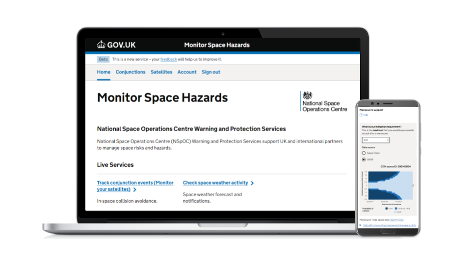

# Monitor Space Hazards (front-end)
`sst-beta` is a Next.JS app which is deployed to render the front-end for the Monitor Space Hazards service. Monitor Space Hazards is the National Space Operations Centre's (NSpOC) warning and protection SST service for UK satellites.

It is deployed at [https://www.monitor-space-hazards.service.gov.uk/](https://www.monitor-space-hazards.service.gov.uk/).

## Technical documenation

### Before you start
You will first need to ensure you have [Node LTS](https://nodejs.org/en/download/) and [Pnpm](https://pnpm.io/installation) installed. You can check by running `pnpm --version`.

Create a copy of `.env.example` as `.env` and fill in relevant secrets. You will need to obtain these from the development team.

You will need a running version of the back-end API. You may wish to use the hosted back-end dev environment. If you wish you can also set up a [local copy of the back-end](https://github.com/UKSpaceAgency/sst-beta-python-backend) too.

### Running a local dev environment
Run `pnpm install` to install project dependencies then `pnpm dev:next` to run a local copy of the app (bound to `localhost` on IPv6).

> **Note:**
> To run a copy that can be accessed outside your local machine you need to run `yarn nx serve --hostname=0.0.0.0 --port=3000` - this binds to IPv4 on a port of your choice.

### Additional docs
* [Tech docs website for Monitor Space Hazards](https://mys-tech-docs.onrender.com/)

## License
[MIT License](LICENSE)

## Support
This software is maintained by the team at:  `monitorspacehazards [at] ukspaceagency [dot] gov [dot] uk`
